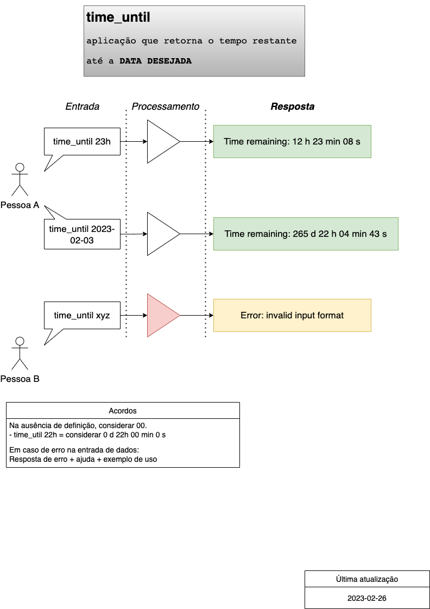

# time-until-cli
> Application that calculate time duration until reach a given date.

**Main objective**: Understanding the logic of _Python_ app publishing and documenting it on a simple project.

## Usage

```bash
time_until 22h
```

## Application flow & use cases

Using CLI to calculate time duration to a given input date or timestamp. 

| Input | Output / Response |
| :---- | :---------------- |
| `time-until 23h` | Time remaining: 8 hour(s) 22 minute(s) 42 second(s) |
| `time-until 2023-02-27` | Time remaining: 04 month(s) 14 day(s) 8 hour(s) 22 minute(s) 42 second(s)  |



## Main goals

Build a Python app that works as a CLI (Command-line Interface) that receives a future date or time and returns a calculation of remaining time from now until that given date or time.

Once working, this project must be configured and submitted as Python package thru PyPI Modules. The process of development, build, release and publishing is the core of the project, to understand it and provice ideas and thoghts of process automation.

Feel free to initiate a discusison, open a issue or a pull request to this project. All kinds of contributions and ideas are welcome. **_Let's code!_**